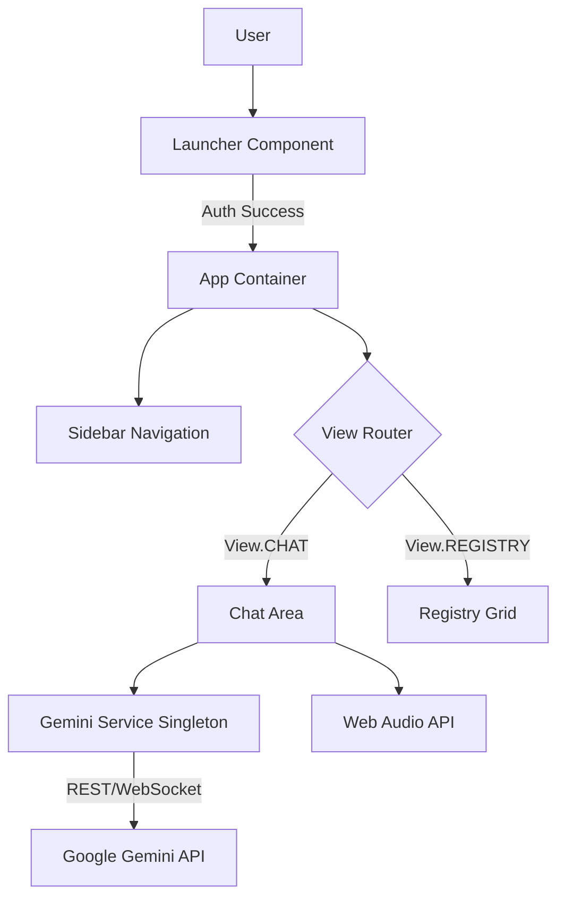

# System Architecture: Project Phoenix

**Version:** 1.1.0
**Status:** [ONLINE]

## 1. High-Level Overview

Regis is a **Hybrid Serverless Application** designed for high-performance AI interaction. It combines a "Zero-Build" philosophy for the frontend (React 19) with a lightweight Python backend for server-side orchestration and configuration.

### Core Principles
-   **Client-Side Sovereignty:** High-bandwidth AI tasks (Streaming, Live Audio) occur directly in the browser to minimize latency.
-   **Serverless Extensions:** Python functions (Vercel Runtime) handle environment configuration, security checks, and future orchestrated tasks.
-   **Ephemeral & Persistent State:** Session data is handled in memory, while long-term data (Registry, Chat History) is persisted to `localStorage`.
-   **Direct & Proxied API:**
    -   *Generative Tasks:* Direct connection to Gemini API via `@google/genai`.
    -   *System Tasks:* Proxied requests to the Python backend via `/api/*`.

## 2. Component Architecture

The application is structured around a central `App` container that manages authentication and view routing.

### 2.1. Key Components

*   **`Launcher.tsx`**: The entry gate. Simulates a bios-level login screen. Handles simple credential validation and sets the initial "authorized" state.
*   **`ChatArea.tsx`**: The primary interface. Manages the message stream, attachment handling, and tool execution. It handles the complex state of "Live Mode" (WebRTC/WebSocket audio streaming).
*   **`Registry.tsx`**: A dashboard for viewing saved insights. Implements filtering and searching logic over the `localStorage` dataset.
*   **`Sidebar.tsx`**: Pure presentation component for navigation.

## 3. Data Flow

### 3.1. Chat Interaction
1.  **Input:** User types text or attaches media.
2.  **Service Call:** `sendMessageStream` in `geminiService.ts` is invoked.
3.  **API Request:** A multipart request (Text + Base64 Media) is sent to `gemini-3-pro-preview`.
4.  **Streaming Response:** Chunks are received and appended to the `bot` message state in real-time.
5.  **Grounding:** Grounding metadata (Search/Maps citations) is extracted from chunks and rendered as citations.

### 3.2. Registry Persistence
1.  **Action:** User clicks "Save" on a bot message.
2.  **Processing:** 
    - The content is sent to `gemini-2.5-flash` to generate a concise title.
    - A new `RegistryItem` object is created with tags and timestamp.
3.  **Storage:** The item is pushed to the `registryItems` state array.
4.  **Persistence:** A `useEffect` hook detects the state change and serializes the array to `localStorage`.

### 3.3. Live Mode (Audio)
1.  **Connection:** `connectLiveSession` establishes a WebSocket via the `ai.live.connect` method.
2.  **Input Stream:** `AudioContext` captures Microphone input, downsamples it to 16kHz PCM, and sends it via the socket.
3.  **Output Stream:** The model returns raw PCM audio chunks.
4.  **Playback:** A custom `AudioStreamPlayer` class buffers these chunks and schedules them for gapless playback using the Web Audio API.

## 4. Technology Standards

*   **State Management:** React `useState` / `useReducer`. No external libraries (Redux/Zustand) to keep the bundle lean.
*   **Styling:** Tailwind CSS utility classes.
*   **Icons:** Lucide React for consistent vector iconography.
*   **Type Safety:** TypeScript interfaces defined in `types.ts`.

## 5. Security Protocols

*   **API Key:** Injected via `import.meta.env` (Vite) or `os.environ` (Python).
*   **Data Privacy:** All user data resides in `localStorage` and is never sent to a third-party server other than Google's AI endpoints for processing.

## 6. Development Environment

To ensure a seamless developer experience (DX), the project uses a custom local orchestration layer:

### 6.1. Supervisor (Backend)
-   **File:** `api/local_server.py`
-   **Function:** Wraps the Vercel-compatible `handler` in a standard Python `HTTPServer`.
-   **Auto-Reload:** A custom file watcher monitors `api/*.py` (ignoring `__pycache__`) and restarts the server process immediately upon detection of changes.

### 6.2. Proxy (Frontend)
-   **Config:** `vite.config.ts`
-   **Function:** Forwards all requests matching `/api/*` from the Vite dev server (port 3000) to the Python Supervisor (port 8000).
-   **Benefit:** Simulates the Vercel production routing environment locally, preventing CORS issues and path mismatches.
