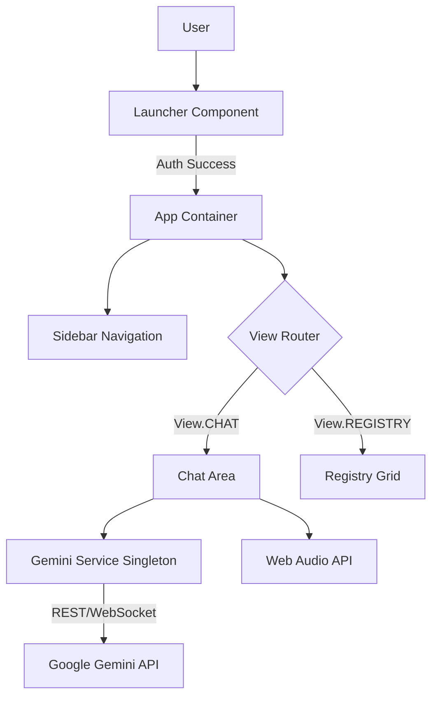

# System Architecture: Project Phoenix

**Version:** 1.0.0  
**Status:** [ONLINE]

## 1. High-Level Overview

Regis is a Single Page Application (SPA) designed as a "Zero-Build" React app that runs directly in the browser using ES Modules. This architecture allows for rapid prototyping and deployment without heavy build pipelines, while still leveraging modern frameworks like React and Tailwind CSS.

### Core Principles
-   **Client-Side Sovereignty:** All logic, including AI model orchestration, happens in the user's browser.
-   **Ephemeral & Persistent State:** Session data is handled in memory, while long-term data (Registry, Chat History) is persisted to `localStorage`.
-   **Direct API Integration:** The app communicates directly with Google's Gemini API endpoints using the `@google/genai` SDK.

## 2. Component Architecture

The application is structured around a central `App` container that manages authentication and view routing.

### 2.1. Key Components

*   **`Launcher.tsx`**: The entry gate. Simulates a bios-level login screen. Handles simple credential validation and sets the initial "authorized" state.
*   **`ChatArea.tsx`**: The primary interface. Manages the message stream, attachment handling, and tool execution. It handles the complex state of "Live Mode" (WebRTC/WebSocket audio streaming).
*   **`Registry.tsx`**: A dashboard for viewing saved insights. Implements filtering and searching logic over the `localStorage` dataset.
*   **`Sidebar.tsx`**: Pure presentation component for navigation.

## 3. Data Flow

### 3.1. Chat Interaction
1.  **Input:** User types text or attaches media.
2.  **Service Call:** `sendMessageStream` in `geminiService.ts` is invoked.
3.  **API Request:** A multipart request (Text + Base64 Media) is sent to `gemini-3-pro-preview`.
4.  **Streaming Response:** Chunks are received and appended to the `bot` message state in real-time.
5.  **Grounding:** Grounding metadata (Search/Maps citations) is extracted from chunks and rendered as citations.

### 3.2. Registry Persistence
1.  **Action:** User clicks "Save" on a bot message.
2.  **Processing:** 
    - The content is sent to `gemini-2.5-flash` to generate a concise title.
    - A new `RegistryItem` object is created with tags and timestamp.
3.  **Storage:** The item is pushed to the `registryItems` state array.
4.  **Persistence:** A `useEffect` hook detects the state change and serializes the array to `localStorage`.

### 3.3. Live Mode (Audio)
1.  **Connection:** `connectLiveSession` establishes a WebSocket via the `ai.live.connect` method.
2.  **Input Stream:** `AudioContext` captures Microphone input, downsamples it to 16kHz PCM, and sends it via the socket.
3.  **Output Stream:** The model returns raw PCM audio chunks.
4.  **Playback:** A custom `AudioStreamPlayer` class buffers these chunks and schedules them for gapless playback using the Web Audio API.

## 4. Technology Standards

*   **State Management:** React `useState` / `useReducer`. No external libraries (Redux/Zustand) to keep the bundle lean.
*   **Styling:** Tailwind CSS utility classes.
*   **Icons:** Lucide React for consistent vector iconography.
*   **Type Safety:** TypeScript interfaces defined in `types.ts`.

## 5. Security Protocols

*   **API Key:** Injected via `process.env.API_KEY`. The architecture assumes a secure environment where this key is not exposed to unauthorized public users (e.g., an internal tool or local deployment).
*   **Data Privacy:** All user data resides in `localStorage` and is never sent to a third-party server other than Google's AI endpoints for processing.
